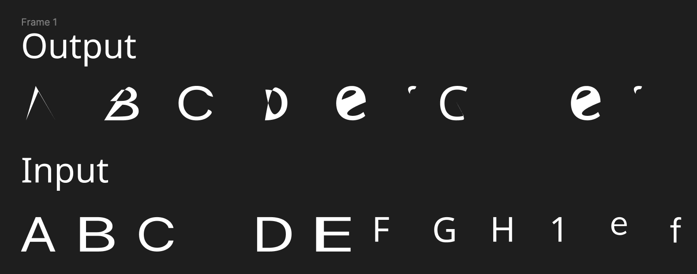
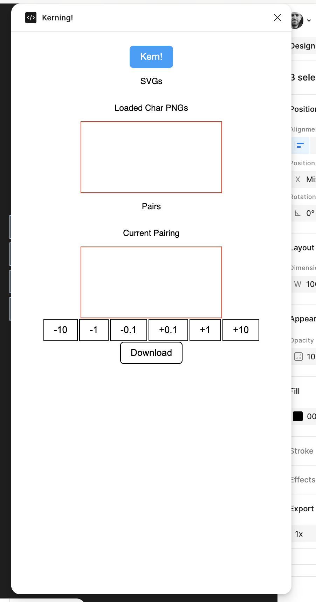
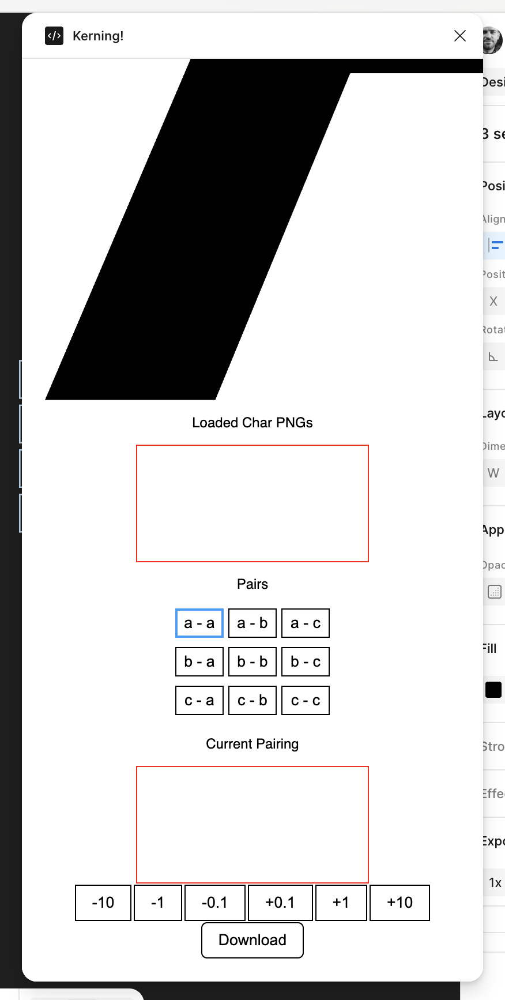

# Kerning

What even?

Grabs svgs from Figma, does terrible things to them, outputs a mostly broken font file.

What was supposed to happen with comments below for further research.

1. Create vectors in Figma titled `letter_a` and so on.
    - SVGs expect viewbox so the some code should be reading that somewhere.
1. Use `controller.ts` to grab both a PNG and SVG from Figma.
    - Realizing that PNG probably wasn't needed since fonts want vectors.
1. Load the PNGs into React
    - I spent so long screwing with the vectors' sizes that now none of the PNGs are visible in React.
    - A rewrite to use just SVGs and load them onto the screen instead of PNGs might highlight some bugs. From all my console logging the SVGs seemed fine.
1. Adjust kernings.
    - Because of the point mentioned in the previous step, none of the PNGs are visible.
1. Begin font creation. 
    - No idea if any of the values in makeFont.ts are remotely correct. I know so little about fonts. 
1. Convert SVGs to Paths which is what is needed for a font
1. Attach the kerning table to the font
1. Name it, save it, download it.

screenshot1

screenshot2

